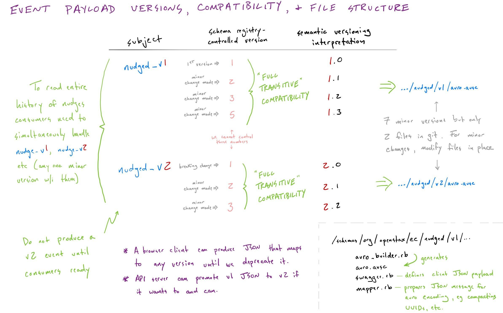

# OpenStax Event Capture API

[](https://travis-ci.com/openstax/event-capture-api)

The API interface to capture events within OpenStax

## Dependencies

This app captures events from OpenStax apps and makes the available to other OpenStax
systems for analysis and interactivity.

## Running the API on localhost

```bash
$> bundle install
%> bundle exec rake setup # one time only
$> bundle exec rails s
```

### Generating files with the Swagger JSON

Run `rake write_swagger_json` to write Swagger JSON files to `tmp/swagger` for each major API version.

### Tests

Run the tests with `rspec` or `rake`.

</details>

## Using Docker Development Environment

You will need [docker](https://docs.docker.com/get-docker/) and [docker-compose](https://docs.docker.com/compose/install/#install-compose) installed.

Use the `./docker/compose` proxy for running all commands, it hooks in a base config file for Kafka

```bash
# turning it on and off
./docker/compose up # turns everything on
./docker/compose up control-center # turn particular services on (includes dependencies)
./docker/compose up api # the rails API server only
./docker/compose up -d api && docker attach docker_api_1 # run rails, watch output, and debug
./docker/compose up -d # turns everything on in the background
./docker/compose down # turns everything off
./docker/compose ps # list running things

# control-center (overview of Kafka information)
open http://localhost:9021/clusters

# rails api
./docker/compose run --rm api rake spec # run specs
./docker/compose run --rm api <command> # run arbitrary command in api container

open http://localhost:3001 # docker binds the api to port 3001 to avoid conflicting with the same running on the host
```

</details>

## Test data in Kafka

### Kafka Connect Datagen
The docker compose environment includes [kafka-connect-datagen](https://github.com/confluentinc/kafka-connect-datagen) which is a utility for
creating and dispatching test events. A list of sample event configurations are available [here](https://github.com/confluentinc/kafka-connect-datagen/tree/master/config). If you download one of those json configs you can run this to start it.
```
curl -X POST -H "Content-Type: application/json" --data @connector_pageviews.config http://localhost:8083/connectors
```

After starting it you will see new topics and information available in the control-center ui, you can also run this command to watch the events:
```
./docker/compose exec connect kafka-console-consumer --topic pageviews --bootstrap-server broker:29092
```

and this to stop it:
```
curl -X DELETE http://localhost:8083/connectors/datagen-pageviews
```

## Schemas and Versions

There are 3 different kinds of schemas in event capture:

1. The outer API schema (JSON-based) that defines general means of posting events; this schema should not change often.
2. An inner API schema (JSON-based) that defines the fields of the various event payloads; these schemas may change regularly as new fields are added, breaking changes are made to existing events, or new events are added.
3. Schemas that define how the event payload data is stored within Kafka (Avro-based); these will change about the same amount as the "inner API" does.

These 3 schemas are connected to 4 different version numbers:

1. The outer API schema has a version that is seen in the URL path of requests sent to the API (e.g. `...openstax.org/api/v0/events/...`).
2. The event payload APIs ("inner API") have versions that are distinct from the outer API version and distinct from each other.  E.g. the event payload for describing when highlights are created has a version number that is independent of the version number for the event payload that records nudges.  Within the inner API, you'll see objects like `NudgeV1`.  This "v"-number is the version we are referring to in this bullet.  Think of it like a major version number in a semantic versioning context.  You the developer can make minor changes to "v1" of an event payload API without bumping this version number.  If you need to make breaking changes, you start a new "v2" version of the API schema.
3. We use a one-to-one mapping between the JSON API defined for an event payload and the Avro schema that controls how the event is written to Kafka.  Note that it is normal for some fields to be in the Avro schema that aren't in the JSON schema, and vice versa (e.g. Avro schemas typically include a field for a user UUID, but that information is conveyed to the JSON API via a cookie, not a JSON field).  The major version of the Avro schema tracks with the major version of the inner API JSON schema.
4. The fourth version number is more hidden -- we store Avro schemas in a Schema Registry.  When minor changes happen in our schema definition and we push those to the Schema Registry, the Schema Registry assigns its own version number to those new schemas.  Each minor change we made to one of our schemas results in a new one of these internal-to-the-Schema-Registry version numbers.  We can read these version numbers from the Schema Registry and we can even request the schema that belongs to them, but they aren't particularly useful to us.
 and 4 different schema versions to understand in event capture.

We define the outer API schema in `..._swagger.rb` classes in `app/controllers/api/v[0,1,...]`.

The event payload JSON and Avro schemas are defined in `schemas/org/openstax/ec/[event name]/v[major version]`.  In these folders you'll see three files:

* `avro_builder.rb` - uses the [Avro Builder](https://github.com/salsify/avro-builder) DSL to define Avro schemas.
* `swagger.rb` - uses the Swagger Blocks DSL to define Swagger schemas (visible through `api/v0/swagger`, usable for swagger-ui documentation and swagger-codegen code generation).
* `avro.avsc` - An Avro file automatically generated from `avro_builder.rb`



### Schema Registry

The Schema Registry and client gems for it are used to encode/decode events stored in Kafka.  Schemas are sent to the registry when encoding happens.  This code repository stores the schemas from the 'org.openstax.ec' namespace ("ec" == "event capture").  To modify the schemas, change the schema DSL in 'schemas/org/openstax/ec/[event name]/v[major version]/avro_builder.rb', then regenerate the avsc files thru the following rake task

```bash
$> bundle exec rake generate_avro
```

Handy local schema registry http interactions

```
GET http://localhost:8081/subjects
GET http://localhost:8081/subjects/org.openstax.ec.nudged/versions
DELETE http://localhost:8081/subjects/org.openstax.ec.nudged
DELETE http://localhost:8081/subjects/org.openstax.ec.nudged?permanent=true
```

### Swagger, Clients, and Bindings

The Event Capture API is documented in the code using Swagger.  Swagger JSON can be accessed at `/api/v0/swagger`.

Note: Event payloads are swagger validated and avro validation.  The `swagger.rb` file for the event lives alongside the generated avsc file in the same versioned directory.

#### Autogenerating bindings

Within the baseline, we use Swagger-generated Ruby code to serve as bindings for request and response data.  Calling `./docker/compose run --rm api rake openstax_swagger:generate_model_bindings[X]` will create version `X` request and response model bindings in `app/bindings/api/vX`.  Note that this `X` is the version of the outer API, and its bindings will include all available versions of the inner event data (see the section above about the different kinds of versions we deal with).  It is important to run this inside Docker so that the version of swagger-codegen is the same for everyone.

See the documentation at https://github.com/openstax/swagger-rails for more information.

#### Updating an event payload

If you want to make a non-breaking change to an event payload, e.g. adding an optional field, you'd modify the `swagger.rb` and `avro_builder.rb` files, then run the `generate_avro` and `openstax_swagger:generate_model_bindings[X]` rake tasks.

If however you wanted to make a breaking change to a payload, e.g. for the `nudged` event, you'd copy the contents of the `schemas/org/openstax/ec/nudged/v1` directory to a new `schemas/org/openstax/ec/nudged/v2` directory.  Then make your changes in the `v2` directory and run the rake tasks.

## Contributing

See [CONTRIBUTING.md](./CONTRIBUTING.md)
